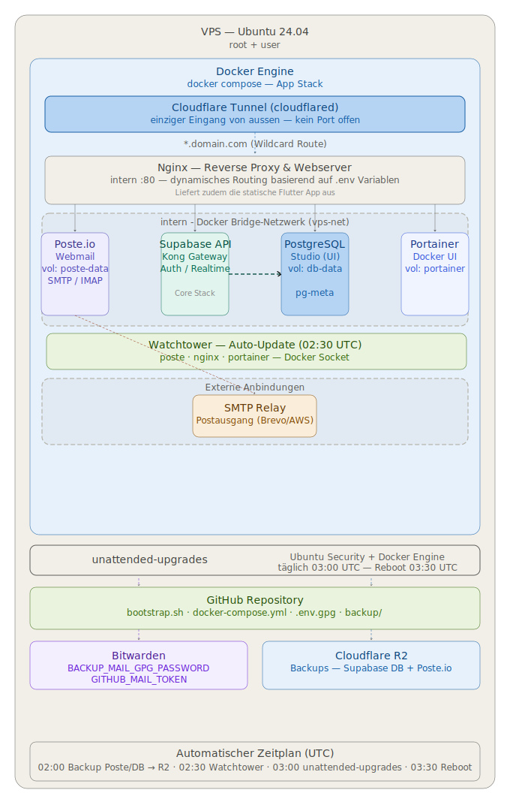

> Persönlicher Mail- & Webserver-Stack auf einem selbst gehosteten VPS — vollständig automatisiert, verschlüsselt gesichert und auf jedem Ubuntu 24.04 VPS in wenigen Minuten wiederherstellbar.

Der Stack ist hosterunabhängig: Secrets liegen verschlüsselt in GitHub, Daten in Cloudflare R2, DNS und Tunnel in Cloudflare. Ein Wechsel erfordert nur `bootstrap.sh` auf dem neuen VPS auszuführen — der Rest ist automatisch.

## Schnellstart — Neuinstallation
```bash
# Als root auf frischem Ubuntu 24.04 VPS
curl -fsSL https://raw.githubusercontent.com/Alexstuder/MailAndWebServerVPSBootstraper/main/bootstrap.sh \
  -o bootstrap.sh
chmod +x bootstrap.sh
./bootstrap.sh
```

Das Script fragt nur nach:
1. Bitwarden E-Mail
2. Bitwarden Master-Passwort
3. Passwort für den Admin-User

Alles andere kommt automatisch aus der verschlüsselten `.env.gpg` im Repo.
Neuestes Backup wird automatisch von Cloudflare R2 wiederhergestellt.

---



## Services
| URL | Service |
|-----|-------|
| [mail.domain.com] | Poste.io (Mailserver / Admin) |
| [www.domain.com] | nginx (Flutter Web App) |
| [api.domain.com] | Supabase API & Auth |
| [db.domain.com] | Supabase Studio |
| [portainer.domain.com] | Portainer |

## Externe Services
| Service | Zweck |
| :--- | :--- |
| **[Cloudflare](https://dash.cloudflare.com/)** | DNS, Tunnel, R2 Backups |
| **[Bitwarden](https://vault.bitwarden.com/)** | BACKUP_MAIL_GPG_PASSWORD, GITHUB_MAIL_TOKEN |
| **[SMTP Relay](https://app.brevo.com/)** | Postausgang für Poste.io (Brevo / Amazon SES) |

## Docker Netzwerk
Alle Container laufen im internen Bridge-Netzwerk. Nach aussen ist kein Port offen — einziger Eingang ist der Cloudflare Tunnel.

| Container | Port | User | Notes |
|-----------|------|------------|-------|
| cloudflared | — | 65532:65532 | Tunnel-Eingang |
| poste.io | 80/443 | root | E-Mail, Sieve, Webmail |
| nginx | 80 | www-data | Flutter Web |
| supabase-* | div. | div. | Core Stack (11 Container) |
| portainer | 9000 | root | Login: admin |
| watchtower | — | root | Socket-Zugriff nötig |

## Automatische Updates — Zeitplan (UTC)
| Zeit | Was |
|------|-----|
| 02:00 | Backup (Poste/Supabase) → R2 + Status-Mail |
| 02:30 | Watchtower → Container-Images Update |
| 03:00 | unattended-upgrades → Ubuntu + Docker Engine |
| 03:30 | Automatischer Neustart (Reboot) |

## Backup
- Täglich 02:00 UTC
- GPG AES256 verschlüsselt → Cloudflare R2
- Supabase DB (`db-data`) und Poste.io (`poste-data`)
- Status-Mail nach jedem Lauf

## Dateistruktur
```
~/vps-stack/
├── bootstrap.sh              ← Neuinstallation (hosterunabhängig)
├── docker-compose.yml        ← Stack-Definition
├── architecture.svg          ← Architektur-Diagramm
├── poste-data/               ← Volume (E-Mails & Settings)
├── db-data/                  ← Volume (Supabase PostgreSQL)
├── www/                      ← Volume (Flutter App)
└── backup/
    ├── backup-master.sh
    └── restore/
```
